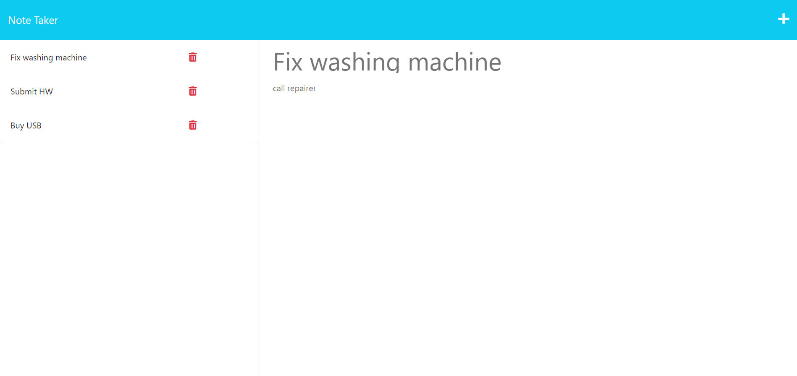

# Note Taker Database

# Website Link 
  https://note-taker-database.herokuapp.com/

## Description
I wanted to create a website that allows me to take notes and have these notes saved into a database. Now, if I go back to the website on a different computer, my notes will be saved and retrieved. 

## Table of contents
- [Installation](#installation)
- [Usage](#usage)
- [License](#license)
- [Contribution](#contribution)
- [Tests](#tests)
- [Questions](#questions)
 

## Installation
N/A

## Usage
Once you enter the website, press on the 'Get Started' button to enter the note taker functionality. Now you can add a title and a body to your note. Once you're done with writing the note, press the save button on the top right. Now your note will appear on the left-hand side. If you click on a note title on the left-hand side, it will load on the right hand side. You can then add another new note by pressing on the + button on the top right. If you're done with a specific note or task, you can delete it by pressing on the bin button. 

## License
MIT License https://opensource.org/licenses/MIT

    Copyright (c) 2023 zeinahares 
    
    Permission is hereby granted, free of charge, to any person obtaining a copy of this software and associated documentation files (the "Software"), to deal in the Software without restriction, including without limitation the rights to use, copy, modify, merge, publish, distribute, sublicense, and/or sell copies of the Software, and to permit persons to whom the Software is furnished to do so, subject to the following conditions:
    
    The above copyright notice and this permission notice shall be included in all copies or substantial portions of the Software.
    
    THE SOFTWARE IS PROVIDED "AS IS", WITHOUT WARRANTY OF ANY KIND, EXPRESS OR IMPLIED, INCLUDING BUT NOT LIMITED TO THE WARRANTIES OF MERCHANTABILITY, FITNESS FOR A PARTICULAR PURPOSE AND NONINFRINGEMENT. IN NO EVENT SHALL THE AUTHORS OR COPYRIGHT HOLDERS BE LIABLE FOR ANY CLAIM, DAMAGES OR OTHER LIABILITY, WHETHER IN AN ACTION OF CONTRACT, TORT OR OTHERWISE, ARISING FROM, OUT OF OR IN CONNECTION WITH THE SOFTWARE OR THE USE OR OTHER DEALINGS IN THE SOFTWARE.

## Contribution
N/A 

## Tests
N/A 

## Questions - 
  
Feel free to reach me for questions at anytime!

  GitHub URL: https://github.com/zeinahares 

  Email Address: zeinahares@gmail.com 
